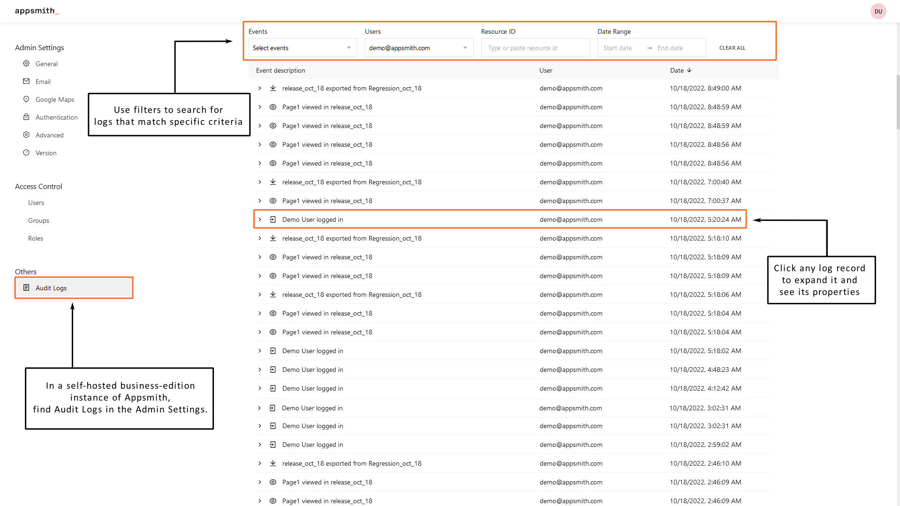

# Audit logs

The audit log is a paper trail of all activities that occur on an Appsmith instance. It automatically captures and displays events by recording what activity was performed, who performed it, and when it occurred. With this information, you can ensure that you're able to easily follow up and address any unexpected or undesirable events.

---


Audit logs are only available on self-hosted, business edition instances of Appsmith.


You can find audit logs by navigating to your [Admin Settings](https://docs.appsmith.com/getting-started/setup/instance-configuration/admin-settings) page, and finding the **Audit Logs** tab under the **Others** heading. From here, you can see all the events that have been tracked under your organization's account, along with the user, date, and time that the event was logged. Click the arrow next to any event to expand it and see its complete set of details in JSON form.

There are several kinds of events that are logged:

- App-specific activity
    - Changes to pages
    - Datasource configuration
    - Query configuration and execution
    - Deleting apps

- Changes to Administrator settings
    - Instance configuration changes

- User sign-up and login activity

For an exhaustive list of events, see [Tracked Events](./15938_Tracked_Events_Draft.md).